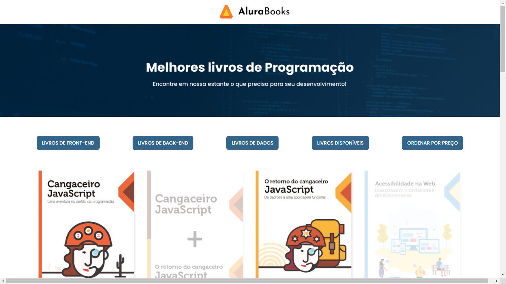

#### Projeto    : alura-books-pi

#### Finalidade : Livraria.

#### Data       : 26/12/2024

#### Formação
[Desenvolvimento Front-end: cursos para criar aplicações web com HTML, CSS e JavaScript](https://cursos.alura.com.br/formacao-javascript-front-end)

#### Curso 1
[Curso de JavaScript: métodos de array](https://cursos.alura.com.br/course/javascript-metodos-array) 

#### Como ficou a tela principal do projeto

